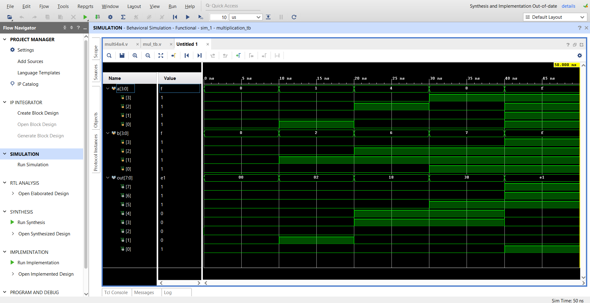
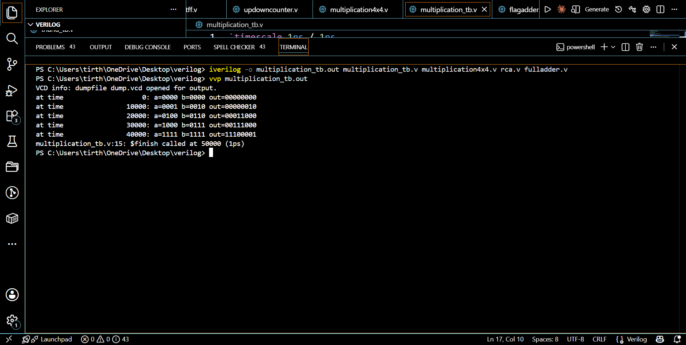

# 4X4-Unsigned-Array-Multiplier-using-Ripple-Carry-Adders-Verilog
A 4×4 unsigned array multiplier built structurally in Verilog — Full Adder → Ripple Carry Adder → Shift-Add Multiplier. Includes testbenches, RTL schematic (Vivado), I/O waveforms (GTKWave), and VCD dumps. Simulated with Icarus Verilog on VS Code. Demonstrates gate-level digital design from scratch, no built-in operators used.

# 🔢 4×4 Unsigned Array Multiplier using Ripple Carry Adders — Verilog

A structural Verilog implementation of a **4-bit × 4-bit unsigned array multiplier**, built from the ground up using **Full Adders → Ripple Carry Adders (RCA) → Shift-Add Array Multiplier**. Designed, simulated, and verified using **Icarus Verilog**, **GTKWave**, **Xilinx Vivado**, and **VS Code**.

---

## 📑 Table of Contents

1. [Overview](#-overview)
2. [Project Architecture](#-project-architecture)
3. [Repository Structure](#-repository-structure)
4. [Tools Used](#-tools-used)
5. [Module-by-Module Explanation](#-module-by-module-explanation)
   - [1. Full Adder](#1️⃣-full-adder-fulladder)
   - [2. Ripple Carry Adder](#2️⃣-ripple-carry-adder-rca)
   - [3. Array Multiplier](#3️⃣-array-multiplier-multiplication)
   - [4. Testbenches](#4️⃣-testbenches)
6. [How the Multiplier Works (Theory)](#-how-the-multiplier-works-theory)
7. [Waveforms & Schematics](#-waveforms--schematics)
8. [How to Run (Icarus Verilog)](#️-how-to-run-icarus-verilog--gtkwave)
9. [How to Run (Xilinx Vivado)](#-how-to-run-xilinx-vivado)
10. [Sample Simulation Output](#-sample-simulation-output)
11. [Test Cases Covered](#-test-cases-covered)
12. [Future Improvements](#-future-improvements)
13. [Author](#-author)
14. [License](#-license)

---

## 📖 Overview

This project implements a **4×4 unsigned binary multiplier** entirely at the **gate/structural level** in Verilog — no `*` operator is used anywhere. The multiplier is built layer by layer:

- A **Full Adder** is designed using basic Boolean equations (`assign`).
- Four Full Adders are chained to form a **4-bit Ripple Carry Adder (RCA)**.
- The RCA is then reused **three times** inside the multiplier to add shifted partial products together, exactly the way multiplication is done by hand (long multiplication in binary), producing an **8-bit product** from two 4-bit unsigned inputs.

This bottom-up design approach (Full Adder → RCA → Multiplier) is a classic digital design technique used to teach and build **array multipliers**, which are widely used in ALUs, DSPs, and processor datapaths.

---

## 🏗 Project Architecture

```
                ┌─────────────────────┐
                │      Full Adder     │  (fulladder.v)
                └──────────┬──────────┘
                           │  (x4, chained)
                           ▼
                ┌─────────────────────┐
                │ Ripple Carry Adder  │  (rca.v)
                └──────────┬──────────┘
                           │  (x3, reused)
                           ▼
                ┌─────────────────────┐
                │ 4x4 Array Multiplier│  (multiplication4x4.v)
                └──────────┬──────────┘
                           │
                           ▼
                  8-bit Product Output
```

**Data flow inside the multiplier:**

```
a[3:0] × b[3:0]  →  16 Partial Products (AND gates)
                 →  Row-wise addition using 3 Ripple Carry Adders
                 →  8-bit Product  out[7:0]
```

---

## 🗂 Repository Structure

```
├── fulladder.v                  # 1-bit Full Adder module
├── rca.v                        # 4-bit Ripple Carry Adder module
├── multiplication4x4.v          # 4x4 Array Multiplier (top module)
├── fulladder_tb.v               # Testbench for Full Adder
├── rca_tb.v                     # Testbench for RCA
├── multiplication_tb.v          # Testbench for Multiplier
├── dump.vcd                     # Simulation waveform dump file
├── schematic.pdf                # RTL schematic (Vivado)
├── io_wave.png                  # Input/Output waveform (GTKWave)
├── console.png                  # Simulation console output
└── README.md                    # This file
```

> 💡 Rename your uploaded PNGs/VCD to match the names above (or update the paths in this README to match your actual file names).

---

## 🛠 Tools Used

| Tool | Purpose |
|---|---|
| **Icarus Verilog (iverilog)** | Compiling and simulating Verilog RTL + testbenches |
| **GTKWave** | Viewing `.vcd` waveform dumps generated by simulation |
| **Xilinx Vivado** | RTL schematic generation, synthesis, and design visualization |
| **VS Code** | Writing and editing Verilog code (with Verilog-HDL/SystemVerilog extension) |

---

## 🧩 Module-by-Module Explanation

### 1️⃣ Full Adder (`fulladder.v`)

> 📄 Source code: see [`fulladder.v`](./fulladder.v) in this repo.

**Ports:**
| Port | Direction | Width | Description |
|---|---|---|---|
| `a, b` | input | 1-bit | Operand bits to add |
| `cin` | input | 1-bit | Carry-in from previous stage |
| `s` | output | 1-bit | Sum bit |
| `c` | output | 1-bit | Carry-out |

**Logic:**
- `s = a ⊕ b ⊕ cin` — standard XOR sum equation
- `c = (a·b) + (b·cin) + (a·cin)` — majority function, produces carry-out

This is a purely **combinational**, gate-level description of the classic 1-bit full adder.

---

### 2️⃣ Ripple Carry Adder (`rca.v`)

> 📄 Source code: see [`rca.v`](./rca.v) in this repo.

**Ports:**
| Port | Direction | Width | Description |
|---|---|---|---|
| `a, b` | input | 4-bit | 4-bit operands |
| `cin` | input | 1-bit | Initial carry-in |
| `s` | output | 4-bit | 4-bit sum |
| `c` | output | 4-bit | Per-stage carry-outs (`c[0]..c[3]`) |

**Working:** Four `fulladder` instances are **chained** — the carry-out of each stage feeds the carry-in of the next stage (`c[0]→f2`, `c[1]→f3`, `c[2]→f4`), forming a classic **ripple carry adder**. `c[3]` is the final carry-out of the 4-bit addition.

> Note: in this design, the `rca` module's `c` output is used flexibly by the multiplier — it is wired to intermediate carry/sum bits rather than just a single final carry, since the multiplier reuses it as a general 4-bit adder block.

---

### 3️⃣ Array Multiplier (`multiplication4x4.v`)

> 📄 Source code: see [`multiplication4x4.v`](./multiplication4x4.v) in this repo.

**Ports:**
| Port | Direction | Width | Description |
|---|---|---|---|
| `a, b` | input | 4-bit each | Multiplicand and Multiplier |
| `out` | output | 8-bit | Final product (a × b) |

**Internal signals:**
- `w[14:0]` — holds all 15 partial products (AND of `a[i]` and `b[j]`) other than `out[0]`
- `w1, w2, w3 [4:0]` — intermediate sum/carry results from each RCA stage
- `w5, w6, w7 [2:0]` — intermediate carry chains reused between RCA stages

**Step-by-step working:**

1. **Partial Product Generation (AND array):**
   Each bit of `a` is ANDed with each bit of `b`, generating 16 partial product bits total (`a[i] & b[j]`), forming a 4×4 grid — exactly like manual binary long multiplication.

2. **Row 0 (weight 2⁰):** `out[0] = a0·b0` (LSB — needs no addition, direct output)

3. **First RCA (`r1`):** Adds Row-0 partial products (shifted by 1) with Row-1 partial products (`b1·a[3:0]`), producing an intermediate sum `w1` and carry chain `w5`. `out[1]` is taken directly from this stage (`w1[0]`).

4. **Second RCA (`r2`):** Adds the shifted result of `r1` (`w1[4:1]`) with Row-2 partial products (`b2·a[3:0]`), producing `w2` and carry chain `w6`. `out[2] = w2[0]`.

5. **Third RCA (`r3`):** Adds the shifted result of `r2` (`w2[4:1]`) with Row-3 partial products (`b3·a[3:0]`), producing the final 5-bit result `w3[4:0]`, which directly becomes `out[7:3]` — the most significant bits of the product.

This is a textbook **shift-add array multiplier**: each row of partial products is added to the running sum, shifted one position to the left, using cascaded ripple-carry adders — just like doing multiplication by hand in binary.

---

### 4️⃣ Testbenches

| Testbench | Tests | Stimulus |
|---|---|---|
| `fulladder_tb` | 1-bit full adder | All 8 combinations of `a, b, cin` (0–7 in binary) |
| `rca_tb` (RCA testbench) | 4-bit RCA | 4 test vectors of `a, b, cin` |
| `multiplication_tb` | 4×4 multiplier | 5 test vectors including edge cases: `0×0`, small values, and `15×15` (max value) |

Each testbench uses:
- `$dumpfile` / `$dumpvars` → generates `dump.vcd` for GTKWave
- `$monitor` → prints live signal values to console on every change
- `#10` delays between test vectors
- `$finish` → ends simulation

---

## 🧠 How the Multiplier Works (Theory)

Binary multiplication of two 4-bit numbers works exactly like decimal long multiplication:

```
     7     6     5     4     3     2     1     0
                            a3    a2    a1    a0
  ×                         b3    b2    b1    b0
----------------------------------------------------
                          a3b0  a2b0  a1b0  a0b0   <- Row0 (×b0), shift 0
                    a3b1  a2b1  a1b1  a0b1         <- Row1 (×b1), shift 1
              a3b2  a2b2  a1b2  a0b2               <- Row2 (×b2), shift 2
        a3b3  a2b3  a1b3  a0b3                     <- Row3 (×b3), shift 3
----------------------------------------------------
    p7    p6    p5    p4    p3    p2    p1    p0   <- 8-bit product
```

Each row is generated using **AND gates** (a partial product), and the rows are summed together with progressive left-shifts using **Ripple Carry Adders**, exactly as implemented in `multiplication4x4.v`. This is known as an **Array Multiplier** — a fully combinational, gate-efficient multiplier architecture.

---

## 🖼 Waveforms & Schematics

| File | Description |
|---|---|
| `schematic.png` | RTL schematic of the multiplier generated in **Xilinx Vivado** |
| `io_wave.png` | Input/Output waveform of the multiplier captured in **GTKWave** |
| `console.png` | Terminal/console output from `$monitor` during simulation |
| `dump.vcd` | Raw waveform dump — open with GTKWave to inspect all signals |

```markdown



```

---

## ⚙️ How to Run (Icarus Verilog + GTKWave)

### Prerequisites

**Ubuntu/Debian:**
```bash
sudo apt update
sudo apt install iverilog gtkwave
```

**macOS (Homebrew):**
```bash
brew install icarus-verilog
brew install --cask gtkwave
```

**Windows:**
1. Download and install **Icarus Verilog** from the official Windows installer: [http://bleyer.org/icarus/](http://bleyer.org/icarus/) (pick the latest `iverilog-vX.X-setup.exe`). During setup, make sure to check the option to **add Icarus Verilog to PATH**, or add it manually (`C:\iverilog\bin`) to your System Environment Variables.
2. Download and install **GTKWave** — it's bundled with the Icarus Verilog Windows installer above, or can be installed separately from [https://gtkwave.sourceforge.net/](https://gtkwave.sourceforge.net/).
3. Verify installation by opening **Command Prompt** or **PowerShell** and running:
   ```powershell
   iverilog -V
   gtkwave --version
   ```
4. (Alternative) Windows users can also install both tools via **Chocolatey**:
   ```powershell
   choco install icarus-verilog
   ```
5. (Alternative) Or use **WSL (Windows Subsystem for Linux)** and follow the Ubuntu/Debian commands above inside your WSL terminal.

### Run the Full Adder simulation
```bash
iverilog -o fulladder_tb.out fulladder_tb.v fulladder.v
vvp fulladder_tb.out
gtkwave dump.vcd
```

### Run the Ripple Carry Adder simulation
```bash
iverilog -o rca_tb.out rca_tb.v rca.v fulladder.v
vvp rca_tb.out
gtkwave dump.vcd
```

### Run the 4×4 Multiplier simulation
```bash
iverilog -o multiplication_tb.out multiplication_tb.v multiplication4x4.v rca.v fulladder.v
vvp multiplication_tb.out
gtkwave dump.vcd
```

> ⚠️ Always compile the **dependency modules first** (`fulladder.v`, then `rca.v`) before the top-level module, since `rca` instantiates `fulladder`, and `multiplication` instantiates `rca`.

---

## 🧮 How to Run (Xilinx Vivado)

1. Open **Vivado** → `File → New Project` → select **RTL Project**.
2. Add source files: `fulladder.v`, `rca.v`, `multiplication4x4.v`.
3. Add simulation sources: `multiplication_tb.v` (and other testbenches as needed).
4. Set `multiplication` (or the relevant module) as the **Top Module**.
5. Run **Behavioral Simulation**:
   `Flow Navigator → Simulation → Run Simulation → Run Behavioral Simulation`
6. To view the **RTL Schematic**:
   `Flow Navigator → RTL Analysis → Open Elaborated Design → Schematic`
7. Export the schematic as PNG: `File → Export → Export Schematic` or take a screenshot for `schematic.png`.

---

## 📊 Sample Simulation Output

```
at time 0: a=0000 b=0000 out=00000000
at time 10: a=0001 b=0010 out=00000010
at time 20: a=0100 b=0110 out=00011000
at time 30: a=1000 b=0111 out=00111000
at time 40: a=1111 b=1111 out=11100001
```

*(1111 × 1111 = 15 × 15 = 225 = `11100001` in binary ✅)*

---

## ✅ Test Cases Covered

| a | b | Expected out (decimal) | Purpose |
|---|---|---|---|
| 0000 | 0000 | 0 | Zero multiplication |
| 0001 | 0010 | 2 | Simple case |
| 0100 | 0110 | 24 | Mid-range values |
| 1000 | 0111 | 56 | High bit multiplicand |
| 1111 | 1111 | 225 | Maximum value (overflow boundary check) |

---

## 🚀 Future Improvements

- [ ] Extend to an 8×8 or parameterized N×N multiplier
- [ ] Add a synthesizable top-level wrapper with clock/reset for pipelined operation
- [ ] Replace ripple carry adders with **carry look-ahead adders** for higher speed
- [ ] Add SystemVerilog assertions (SVA) for automated verification
- [ ] Add a signed multiplication variant (2's complement)

---

## 👤 Author

Made with ❤️ using **Icarus Verilog**, **Xilinx Vivado**, **GTKWave**, and **VS Code**.
Feel free to ⭐ this repository if you found it useful!

---

## 📄 License

This project is open-source and available under the **MIT License**.


